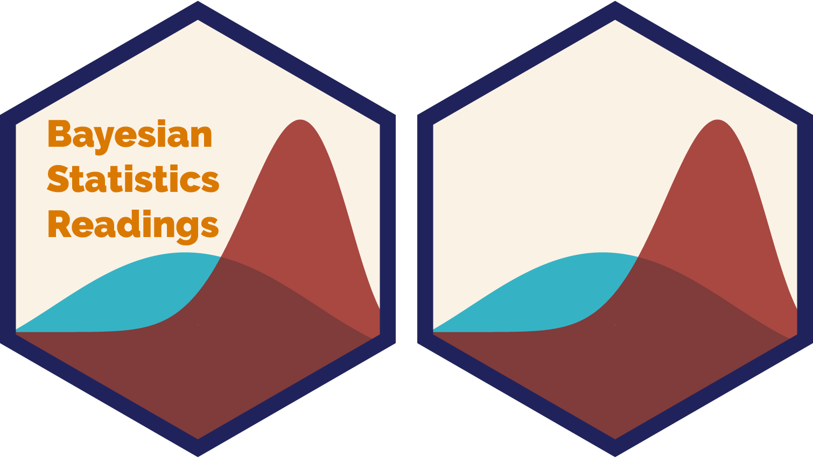
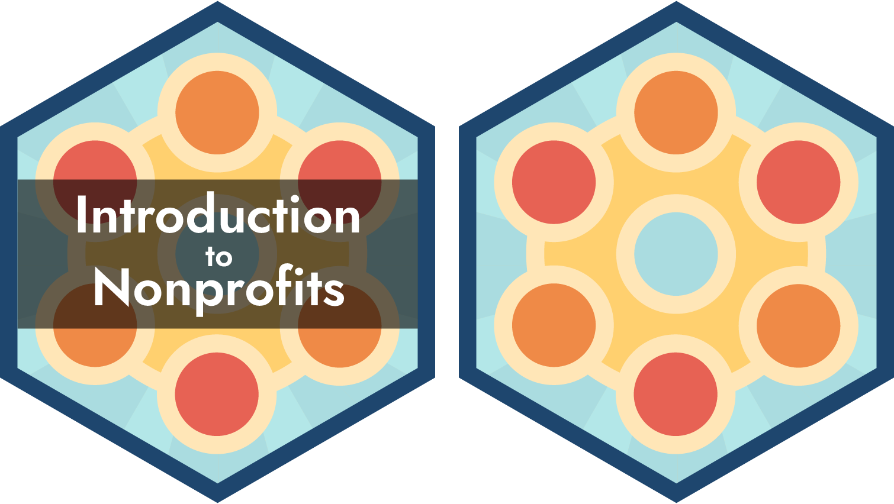

Hex stickers
================

<!-- README.md is generated from README.Rmd. Please edit that file. -->

Inspired by [Mike Kearney](https://github.com/mkearney/hex-stickers),
this is a repository of all the hex stickers I’ve made for packages and
classes.

Unlike Mike and other cool R people, I make my hex stickers by hand in
Adobe Illustrator rather than with R scripts like
[this](https://github.com/mkearney/hex-stickers/blob/master/code.R) or
[this](https://github.com/GuangchuangYu/hexSticker). My hex stickers are
certified artisinal hand-crafted vectors.

The folders here contain PNG, SVG, PDF, and Illustrator versions of each
sticker.

# Stickers


<div style="float:right">

<small>*I used [`hexwall`](https://github.com/mitchelloharawild/hexwall)
to combine these hex stickers*</small>

</div>

- [Classes](#classes)
  - [Comparative public
    administration](#comparative-public-administration)
  - [Bayesian statistics readings](#bayesian-statistics-readings)
  - [Introduction to nonprofits](#introduction-to-nonprofits)
  - [Program evaluation for public
    service](#program-evaluation-for-public-service)
  - [Data science for public
    management](#data-science-for-public-management)
  - [Data visualization](#data-visualization)
  - [Economy, society, and public
    policy](#economy-society-and-public-policy)
- [Packages](#packages)
  - [equatiomatic](#equatiomatic)
  - [quRan](#quran)
  - [scriptuRs](#scripturs)

## Classes

### Comparative public administration

- **Details:** Taught at Georgia State University: [Spring
  2023](https://compasp23.classes.andrewheiss.com/)

- **Font:** [Public Sans](https://public-sans.digital.gov/), an open
  source font developed as part of the General Services Administration’s
  [USWDS](https://designsystem.digital.gov/) (US Web Design System) for
  making accessible federal government websites

- **Colors:** The [Tam](https://github.com/BlakeRMills/MetBrewer#tam)
  palette in [MetBrewer](https://github.com/BlakeRMills/MetBrewer):

  ``` r
  MetBrewer::met.brewer("Tam")
  ```

- **Design:**

  - [Capitol vector by
    MRFA](https://thenounproject.com/term/congress/12741/) and used
    under Creative Commons from [The Noun
    Project](https://thenounproject.com)
  - Globe vector drawn by hand by me


### Bayesian statistics readings

- **Details:** Taught at Georgia State University: [Fall
  2022](https://bayesf22.classes.andrewheiss.com/), [Spring
  2023](https://bayesp23.classes.andrewheiss.com/)

- **Font:** [Raleway](https://fonts.google.com/specimen/Raleway) Black

- **Colors:** The
  [Lakota](https://github.com/BlakeRMills/MetBrewer#lakota) palette in
  [MetBrewer](https://github.com/BlakeRMills/MetBrewer):

  ``` r
  MetBrewer::met.brewer("Lakota")
  ```

- **Design:** Two Beta distributions made with ggplot2, saved with
  `ggsave()`, and wrangled in Illustrator:

  ``` r
  library(tidyverse)
  library(MetBrewer)

  lakota <- met.brewer("Lakota")

  prior_posterior_plot <- ggplot() +
    stat_function(fun = ~dbeta(.x, shape1 = 3, shape2 = 3),
                  geom = "area", alpha = 0.8, n = 500,
                  aes(fill = "Prior")) +
    stat_function(fun = ~dbeta(.x, shape1 = 13, shape2 = 5),
                  geom = "area", alpha = 0.8, n = 500,
                  aes(fill = "Posterior")) +
    scale_fill_manual(values = c(lakota[3], lakota[1]), guide = "none") +
    theme_void()

  ggsave("prior_posterior.pdf", prior_posterior_plot,
         width = 6, height = 4, device = cairo_pdf)
  ```



### Introduction to nonprofits

- **Details:** Taught at Georgia State University: [Spring
  2022](https://nonprofitsp22.classes.andrewheiss.com/), [Fall
  2022](https://nonprofitf22.classes.andrewheiss.com/)

- **Font:** [Jost](https://fonts.google.com/specimen/Oswald) Semibold

- **Colors:** The
  [Hiroshige](https://github.com/BlakeRMills/MetBrewer#hiroshige)
  palette in [MetBrewer](https://github.com/BlakeRMills/MetBrewer):

  ``` r
  MetBrewer::met.brewer("Hiroshige")
  ```

- **Design:** Interlocking circles representing collaboration and
  cooperation



### Program evaluation for public service

- **Details:** Taught at Georgia State University: [Fall
  2019](https://evalf19.classes.andrewheiss.com/), [Spring
  2020](https://evalsp20.classes.andrewheiss.com/)

- **Font:** [Overpass](https://fonts.google.com/specimen/Overpass) Bold

- **Colors:** Generated a palette of 8 colors from the [viridis inferno
  colormap](https://cran.r-project.org/web/packages/viridis/vignettes/intro-to-viridis.html):

  ``` r
  viridisLite::viridis(8, option = "inferno", begin = 0.1, end = 0.9)
  ```

- **Design:** Generic
  [DAG](https://en.wikipedia.org/wiki/Directed_acyclic_graph) showing an
  exposure, an outcome, an indirect effect, a confounder, and a collider


### Data science for public management

- **Details:** Taught at Brigham Young University, Fall 2018 ([class
  website](https://statsf18.classes.andrewheiss.com/))
- **Font:** [Oswald](https://fonts.google.com/specimen/Oswald) Bold +
  Light
- **Colors:** Invented in my head
- **Design:**
  - [Capitol vector by
    MRFA](https://thenounproject.com/term/congress/12741/) and used
    under Creative Commons from [The Noun
    Project](https://thenounproject.com)
  - Normal distribution plotted with
    `ggplot(data_frame(x = -3:3), aes(x = x)) + stat_function(fun = "dnorm")`,
    saved with `ggsave()`, and wrangled in Illustrator


### Data visualization

- **Details:** Taught at Brigham Young University, Fall 2018 ([class
  website](https://datavizf18.classes.andrewheiss.com/))
- **Font:** [Oswald](https://fonts.google.com/specimen/Oswald) Bold
- **Colors:** Adapted from the [viridis plasma
  colormap](https://cran.r-project.org/web/packages/viridis/vignettes/intro-to-viridis.html)
- **Design:** Stylized version of [Hans Rosling’s health + wealth
  plot](https://github.com/jennybc/gapminder)


### Economy, Society, and Public Policy

- **Details:** Taught at Brigham Young University, Winter 2019 ([class
  website](https://econw19.classes.andrewheiss.com/))
- **Font:** [Archivo
  Narrow](https://fonts.google.com/specimen/Archivo+Narrow) Semibold
- **Colors:** Adapted from the [Nord color
  palette](https://github.com/arcticicestudio/nord)
- **Design:**
  - [Capitol vector by
    MRFA](https://thenounproject.com/term/congress/12741/) and used
    under Creative Commons from [The Noun
    Project](https://thenounproject.com)
  - Supply and demand curves drawn by hand in Illustrator


## Packages

### equatiomatic

- **Details:** Converts R model objects into LaTeX equations ([package
  at GitHub](https://github.com/datalorax/equatiomatic))
- **Font:**
  [Consolas](https://learn.microsoft.com/en-us/typography/font-list/consolas)
  and [Computer Modern](https://en.wikipedia.org/wiki/Computer_Modern)
- **Design:**
  - Central text: Stylized combination of a linear model using `lm()`
    syntax and LaTeX mathematical notation
  - Upper text: R code for simulating data and building models
  - Lower text: Excerpt from Galileo’s [“Prima
    giornata”](https://portalegalileo.museogalileo.it/igjr.asp?c=17495)
    in *Discorsi e dimostrazioni matematiche intorno a due nuove
    scienze* ([*Two New
    Sciences*](https://en.wikipedia.org/wiki/Two_New_Sciences)), p. 51


### quRan

- **Details:** Contains full text of the Qur’an for text analysis
  ([package at GitHub](https://github.com/andrewheiss/quRan))
- **Font:** [IBM Plex Sans](https://github.com/IBM/plex) Medium
- **Colors:** Invented in my head
- **Design:** Fatihah background from
  [seeklogo](https://seeklogo.com/vector-logo/183552/sureh-fatiha)


### scriptuRs

- **Details:** Contains full text of the LDS Standard Works (KJV Bible,
  Book of Mormon, Doctrine and Covenants, Pearl of Great Price) for text
  analysis ([package at
  GitHub](https://github.com/andrewheiss/scriptuRs))
- **Font:**
  [MedievalSharp](https://fonts.google.com/specimen/MedievalSharp)
  Medium
- **Colors:** Invented in my head
- **Design:** [Bible vector by Sander
  Leefers](https://thenounproject.com/term/bible/10058) and used under
  Creative Commons from [The Noun Project](https://thenounproject.com)


# License

Everything here is licensed under a
<a rel="license" href="http://creativecommons.org/licenses/by-sa/4.0/">Creative
Commons Attribution-ShareAlike 4.0 International License</a>.

<a rel="license" href="http://creativecommons.org/licenses/by-sa/4.0/"></a>
