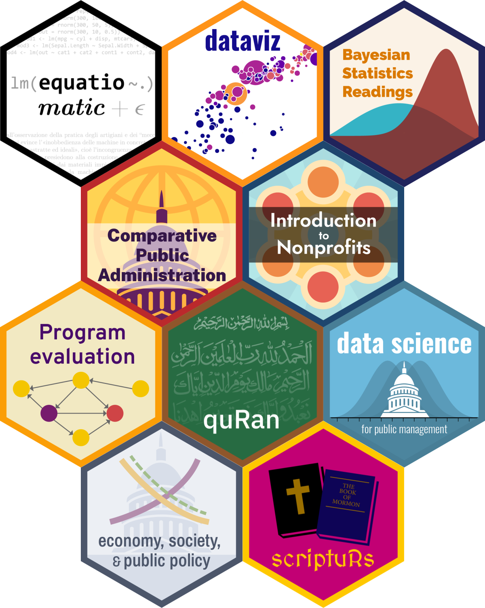
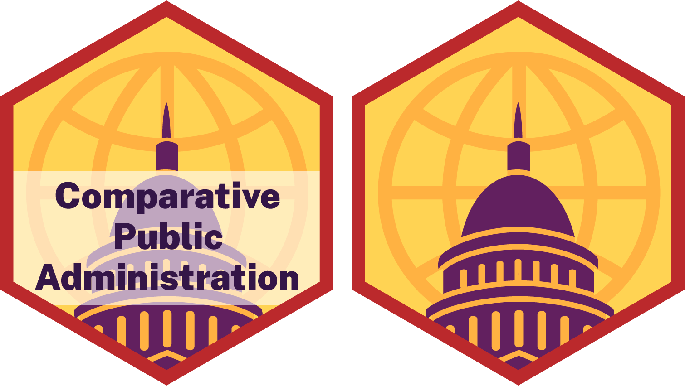

Hex stickers
================

<!-- README.md is generated from README.Rmd. Please edit that file. -->

Inspired by [Mike Kearney](https://github.com/mkearney/hex-stickers),
this is a repository of all the hex stickers I’ve made for packages and
classes.

Unlike Mike and other cool R people, I make my hex stickers by hand in
Adobe Illustrator rather than with R scripts like
[this](https://github.com/mkearney/hex-stickers/blob/master/code.R) or
[this](https://github.com/GuangchuangYu/hexSticker). My hex stickers are
certified artisinal hand-crafted vectors.

The folders here contain PNG, SVG, PDF, and Illustrator versions of each
sticker.

# Stickers

<small>*I used [`hexwall`](https://github.com/mitchelloharawild/hexwall)
to combine these hex stickers*</small>

  - [Classes](#classes)
      - [Data science for public
        management](#data-science-for-public-management)
      - [Data visualization](#data-visualization)
      - [Economy, Society, and Public
        Policy](#economy-society-and-public-policy)
  - [Packages](#packages)
      - [quRan](#quran)
      - [scriptuRs](#scripturs)

## Classes

### Data science for public management

  - **Details:** Taught at Brigham Young University, Fall 2018 ([class
    website](https://statsf18.classes.andrewheiss.com/))
  - **Font:** [Oswald](https://fonts.google.com/specimen/Oswald) Bold +
    Light
  - **Colors:** Invented in my head
  - **Design:**
      - [Capitol vector by
        MRFA](https://thenounproject.com/term/congress/12741/) and used
        under Creative Commons from [The Noun
        Project](https://thenounproject.com)
      - Normal distribution plotted with `ggplot(data_frame(x = -3:3),
        aes(x = x)) + stat_function(fun = "dnorm")`, saved with
        `ggsave()`, and wrangled in
Illustrator

### Data visualization

  - **Details:** Taught at Brigham Young University, Fall 2018 ([class
    website](https://datavizf18.classes.andrewheiss.com/))
  - **Font:** [Oswald](https://fonts.google.com/specimen/Oswald) Bold
  - **Colors:** Adapted from the [viridis plasma color
    palette](https://cran.r-project.org/web/packages/viridis/vignettes/intro-to-viridis.html)
  - **Design:** Stylized version of [Hans Rosling’s health + wealth
    plot](https://github.com/jennybc/gapminder)

### Economy, Society, and Public Policy

  - **Details:** Taught at Brigham Young University, Winter 2019 ([class
    website](https://econw19.classes.andrewheiss.com/))
  - **Font:** [Archivo
    Narrow](https://fonts.google.com/specimen/Archivo+Narrow) Semibold
  - **Colors:** Adapted from the [Nord color
    palette](https://github.com/arcticicestudio/nord)
  - **Design:**
      - [Capitol vector by
        MRFA](https://thenounproject.com/term/congress/12741/) and used
        under Creative Commons from [The Noun
        Project](https://thenounproject.com)
      - Supply and demand curves drawn by hand in
Illustrator

## Packages

### quRan

  - **Details:** Contains full text of the Qur’an for text analysis
    ([package at GitHub](https://github.com/andrewheiss/quRan))
  - **Font:** [IBM Plex Sans](https://github.com/IBM/plex) Medium
  - **Colors:** Invented in my head
  - **Design:** Fatihah background from
    [seeklogo](https://seeklogo.com/vector-logo/183552/sureh-fatiha)

### scriptuRs

  - **Details:** Contains full text of the LDS Standard Works (KJV
    Bible, Book of Mormon, Doctrine and Covenants, Pearl of Great Price)
    for text analysis ([package at
    GitHub](https://github.com/andrewheiss/scriptuRs))
  - **Font:**
    [MedievalSharp](https://fonts.google.com/specimen/MedievalSharp)
    Medium
  - **Colors:** Invented in my head
  - **Design:** [Bible vector by Sander
    Leefers](https://thenounproject.com/term/bible/10058) and used under
    Creative Commons from [The Noun
Project](https://thenounproject.com)

# License

Everything here is licensed under a
<a rel="license" href="http://creativecommons.org/licenses/by-sa/4.0/">Creative
Commons Attribution-ShareAlike 4.0 International
License</a>.

